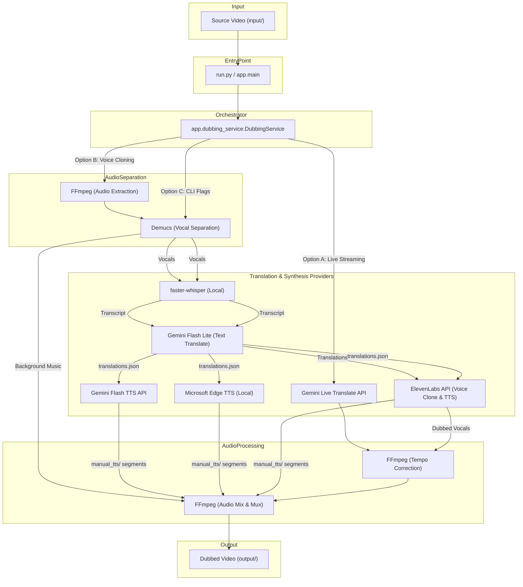

# Agent Guide: Gemini Video Dubbing System (DUB_SOFT)

This document is compiled for AI Coding Agents to understand the architecture, dependencies, and execution pipelines of the `DUB_SOFT` codebase. Use this guide to navigate the repository, debug issues, and implement enhancements efficiently.

---

## 🎯 System Overview

`DUB_SOFT` is a high-fidelity local desktop application designed to dub video files from a source language into a target language. The system offers three distinct workflows:

1. **Fully Automated Gemini Live Translation (Default)**: Audio is extracted, streamed to the Gemini Live Translate WebSocket API in 100ms chunks, translated in real-time, aligned using FFmpeg tempo correction, and remuxed into the video.
2. **Automated Whisper + ElevenLabs Voice-Cloning**: Vocals and background tracks are separated (Demucs). Vocals are transcribed locally (Whisper), translated (Gemini), synthesized with the cloned original voice (ElevenLabs), mixed back with the background music, and remuxed.
3. **Multi-Step Manual TTS Workflow**: Designed for maximum control. The video is prepared (separated and transcribed into `translations.json`), and the user can generate segments via Gemini TTS, Edge TTS, or manual synthetic overrides, then stitch and mux the final video.

---

## 🏗️ Architecture & Component Flow

---

## 📂 Codebase Directory & File Map

* `run.py` - Convenience entry point to parse CLI arguments and call `app.main.main()`.
* `app/` - Core source folder:
  * [config.py](file:///f:/DUB_SOFT/app/config.py) - Loaded settings via Pydantic Settings. Pre-defines BCP-47 languages, defaults, path resolution, and injects `FFMPEG_BIN_DIR` into the system PATH.
  * [models.py](file:///f:/DUB_SOFT/app/models.py) - Data models representing jobs (`DubbingJobResult`, `TranslationResult`, etc.) and enum states.
  * [logger.py](file:///f:/DUB_SOFT/app/logger.py) - Structured JSON/console logging utility. Tracks application lifecycle events (starts, retries, finishes, failures).
  * [ffmpeg_service.py](file:///f:/DUB_SOFT/app/ffmpeg_service.py) - Low-level wrapper for `ffmpeg` and `ffprobe` operations. Manages extraction, pacing, tempo correction, normalization, mixing, slicing, and muxing.
  * [gemini_service.py](file:///f:/DUB_SOFT/app/gemini_service.py) - Facade class. Routes translation requests based on configuration (e.g., uses ElevenLabs if API key exists, otherwise Gemini Live).
  * [watcher.py](file:///f:/DUB_SOFT/app/watcher.py) - Continuously monitors `INPUT_DIR` for new video files using `watchdog`. Implements file stability checks to ensure copying completes before processing. (Note: Currently not wired to the main entry point by default).
  * [dubbing_service.py](file:///f:/DUB_SOFT/app/dubbing_service.py) - Pipeline orchestrator. Handles file manipulation, state saving, and executing the steps for automated and manual workflows.
  * `providers/` - Translation and TTS provider interfaces:
    * [base.py](file:///f:/DUB_SOFT/app/providers/base.py) - Declares the abstract base class `SpeechTranslationProvider` (contract: `translate_audio` and `health_check`).
    * [gemini_live.py](file:///f:/DUB_SOFT/app/providers/gemini_live.py) - Connects to the Gemini Live Translate WebSocket API (`gemini-3.5-live-translate-preview`). Manages session connection, paced binary streaming, audio chunks accumulation, and silent trimming.
    * [whisper_elevenlabs.py](file:///f:/DUB_SOFT/app/providers/whisper_elevenlabs.py) - Automates speech translation via local Whisper transcription, Gemini text translation, and ElevenLabs voice-cloning synthesis.
* `input/` - Directory to place source video files.
* `output/` - Location where dubbed videos are outputted.
* `processing/` - Temporary directory for active job steps, vocal clips, and JSON configurations.
* `failed/` - Backup directory for failed jobs and debugging logs.
* `logs/` - Directory housing the structured application log file (`app.log`).

---

## ⚙️ Configuration & Injections

Environment variables are defined in `.env` (cloned from `.env.example`). The configuration variables shape the active pipeline:
* `GEMINI_API_KEY`: Required for translation and Gemini TTS.
* `ELEVENLABS_API_KEY`: **Trigger Variable**. If set and not using `--live-translate`, the system defaults to the Whisper + ElevenLabs voice-cloning pipeline.
* `FFMPEG_BIN_DIR`: Windows path containing `ffmpeg.exe` and `ffprobe.exe` (useful if not in system environment PATH). Injected automatically by `config.py` using `Settings.apply_ffmpeg_path()`.
* `DEMUCS_MODEL`: Demucs vocal separation model (`htdemucs` default, or `htdemucs_ft` for precision).
* `BACKGROUND_VOLUME`: Volume level (0.0 to 1.0) of background audio merged back into the video.
* `MAX_SEGMENT_SECONDS`: Session duration limit (default 600s/10 mins). Gemini Live WebSocket connections have a ~15-minute cap; longer videos are segmented, processed in separate sessions, and concatenated.

---

## 🔄 Lifecycle Pipelines Details

### Pipeline A: Fully Automated Gemini Live
1. **Audio Extraction**: FFmpeg extracts audio as mono 16 kHz PCM.
2. **Paced WebSocket Stream**: `GeminiLiveProvider` connects to `gemini-3.5-live-translate-preview`. Chunks are streamed in 100ms intervals to prevent rate limits.
3. **Response Aggregation**: Model translates and streams back 24 kHz PCM chunks. Transcription texts are accumulated in logs.
4. **Drift & Tempo Correction**: If translation output length deviates from the source by > `SYNC_THRESHOLD_SECONDS` (default 0.5s), FFmpeg rescales the audio speed.
5. **Mux**: Re-encoded AAC translated audio replaces original audio track in video.

### Pipeline B: Whisper + ElevenLabs Voice-Cloning
1. **Vocal Separation**: Local `demucs` CLI separates vocals (`vocals.wav`) and background music (`no_vocals.wav`).
2. **Local Transcription**: Local `faster-whisper` (`base` model on CPU, `int8` quantization) transcribes vocals.
3. **Vocal Reference**: Extracts a 15-second training clip from vocals.
4. **Gemini translation**: Translates Whisper segments using `gemini-3.1-flash-lite` in a single JSON-matching batch prompt.
5. **ElevenLabs Synthesis**: Temporary cloned voice created via ElevenLabs API using the reference clip, or uses pre-configured `ELEVENLABS_VOICE_ID`. Generates dubbed segments and overlays them at exact timestamps on a silent timeline.
6. **Mux & Mix**: Cloned vocals normalized, mixed with `no_vocals.wav` at `BACKGROUND_VOLUME`, converted to AAC, and remuxed with the video.

### Pipeline C: Multi-Step Manual TTS
Used to review translation accuracy and modify TTS properties.
1. **Preparation (`--prepare`)**: Runs separation (Demucs), local transcription (Whisper), translation (Gemini), extracts original vocal segments into `extracted_vocals/`, and outputs `translations.json`.
2. **Edit Stage**: User opens `translations.json` to alter translations, status (`keep_original` vs `pending`), or speaker voice gender (`female` / `male`).
3. **TTS Generation (`--gemini-tts` or `--edge-tts`)**:
   - `gemini-tts`: Uses `gemini-3.1-flash-tts-preview` and pre-built voices (e.g. Achernar/Fenrir) to generate audio files in `manual_tts/`.
   - `edge-tts`: Uses `edge-tts` Python library to generate local Microsoft voices.
   - Manual download: User can manually generate TTS files and place them as `segment_000.wav` inside `manual_tts/`.
4. **Stitch Stage (`--stitch`)**: Checks for missing files, resamples, stretches long segments to fit exactly, mixes vocals timeline with background stem (`no_vocals.wav`), and muxes.

---

## 🛠️ Operations & CLI Commands

* **Folder Watch Mode (Folder Scan)**:
  `python run.py [--language lang_code]`
* **Single Video File**:
  `python run.py --file input/video.mp4 [--language lang_code]`
* **Live Translate Mode**:
  `python run.py --live-translate [--file input/video.mp4] [--language lang_code]`
* **Manual Pipeline Prep**:
  `python run.py --prepare --file input/video.mp4 [--language lang_code] [--job-id job_id]`
* **Generate manual segments**:
  `python run.py --gemini-tts --job-id job_id`
  `python run.py --edge-tts --job-id job_id`
* **Stitch manual segments**:
  `python run.py --stitch --job-id job_id`

---

## 💡 Code Conventions & Guidelines

* **Async Subprocess Calls**: Since CPU-heavy commands (Demucs, Whisper, FFmpeg) block the event loop, wrap calls in `asyncio.to_thread` or execute subprocesses asynchronously.
* **Path Safety**: Paths configured in settings must be processed through `settings.resolve_path(path)` before creation or reference.
* **FFmpeg discovery**: Prepend `FFMPEG_BIN_DIR` to `os.environ["PATH"]` by executing `settings.apply_ffmpeg_path()` inside entry scripts.
* **Adding new providers**:
  1. Inherit from `SpeechTranslationProvider` in `app/providers/base.py`.
  2. Implement `translate_audio` and `health_check`.
  3. Register provider routing logic in [gemini_service.py](file:///f:/DUB_SOFT/app/gemini_service.py).
* **Adding Languages**: Add valid BCP-47 codes to `SUPPORTED_LANGUAGES` in [config.py](file:///f:/DUB_SOFT/app/config.py).
