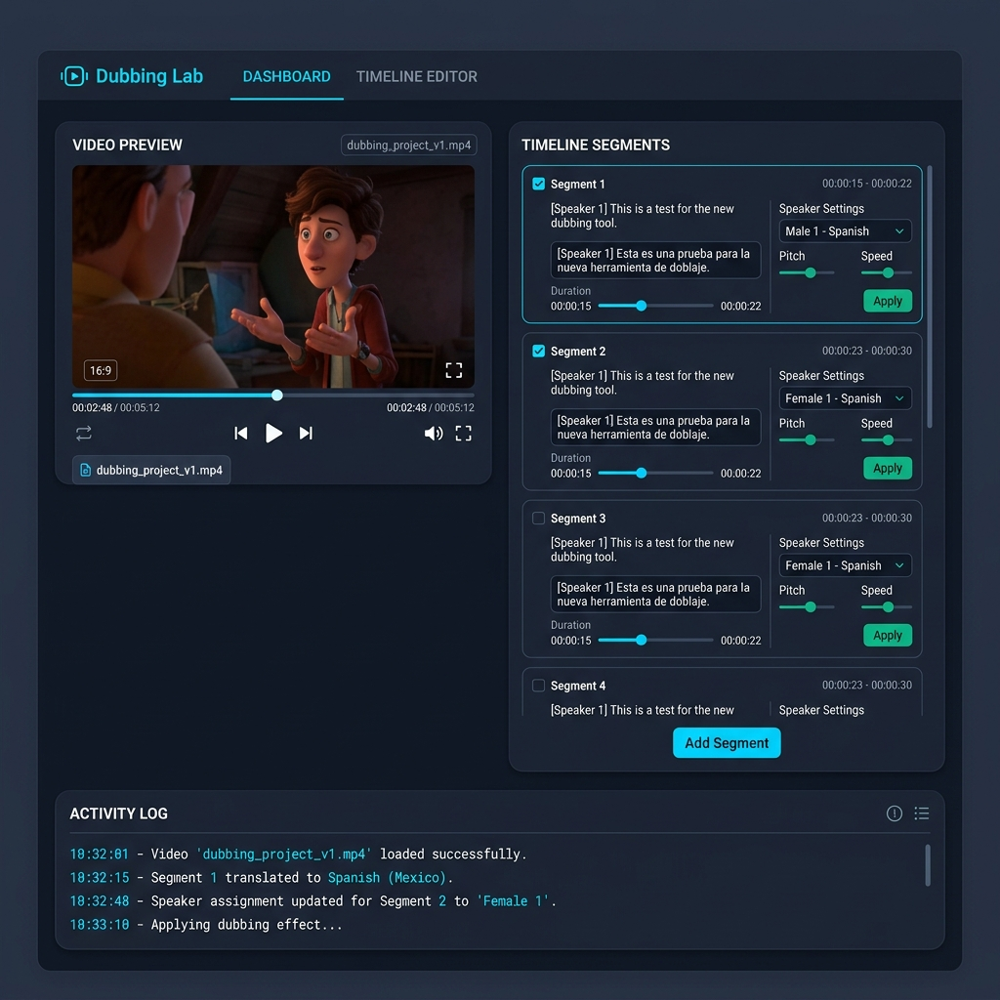
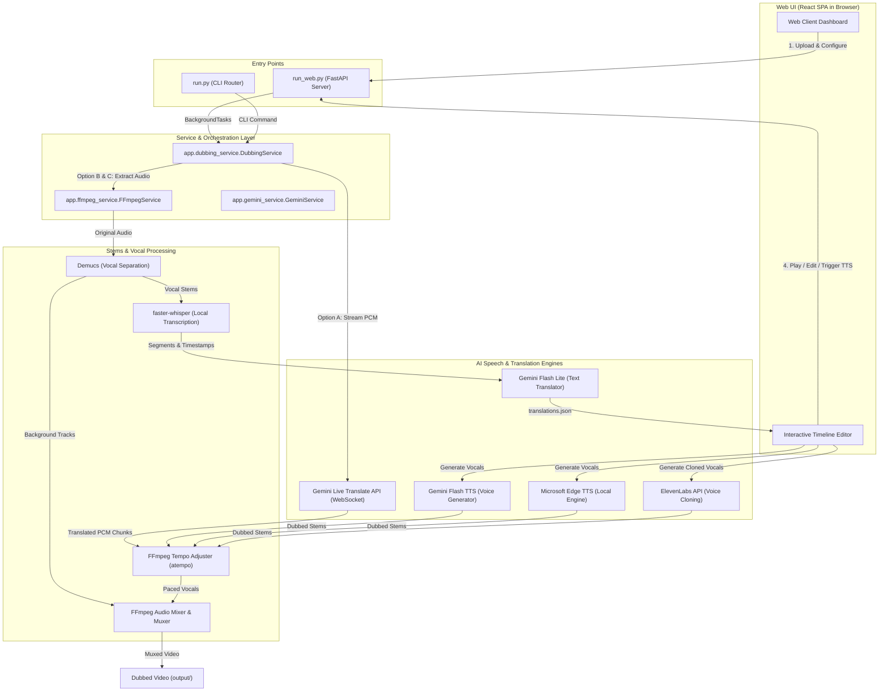

# 🎙️ Dubbing Lab: High-Fidelity Video Dubbing Application

Dubbing Lab is a high-fidelity local desktop application designed to translate and dub video files from a source language into a target language. Built using **FastAPI (Python)** on the backend and **React (TypeScript & TailwindCSS)** on the frontend, it integrates state-of-the-art AI services (Google Gemini, ElevenLabs, Faster-Whisper, Edge-TTS) with advanced multi-track audio processing pipelines.



---

## ⚡ Why This Project Stands Out (For Recruiters & Tech Leads)

This codebase serves as a showcase for production-ready full-stack software engineering, demonstrating:
* **Real-time Streaming & WebSockets**: Handles low-latency 100ms chunked PCM audio streaming to the Gemini Live Translate WebSocket API, managing state, reconnection, and pacing under rate limits.
* **Complex Multi-Track Audio Engineering**: Leverages `ffmpeg` and `demucs` to isolate background music/effects, split vocal stems, adjust tempos dynamically using sub-second audio drift alignment, and remux multi-channel streams back into the final container.
* **State & Job Management in Python**: Implements an async job runner utilizing FastAPI's `BackgroundTasks` to prevent thread-blocking, complete with detailed JSON structured logging (`app.logger`), state persistence, and robust validation.
* **Modular Frontend Architecture**: Built with Vite + TS, featuring custom React hooks, reusable UI elements, responsive state management, and real-time polling to update progress bars and log streams.
* **Configurable & Clean Code**: Adheres to modern Python standards (Pydantic Settings, PEP-8) and strict TypeScript safety rules, making it highly extensible and maintainable.

---

## 🏗️ System Architecture & Data Flow

The following Mermaid diagram outlines the complete system data flow and process separation across the frontend, FastAPI backend, local processors, and external AI service integrations:



---

## 🔄 Core Workflows & Pipelines

The application determines its operational flow based on your environment configurations, CLI flags, or actions triggered in the Web UI:

### 1. Fully Automated Gemini Live (Default / Live Mode)
* **Trigger**: Executed when no ElevenLabs credentials are set, or via the `--live-translate` CLI flag.
* **Mechanism**: Extracts video audio as 16 kHz mono PCM, streams it to the Gemini Live Translate WebSocket API (`gemini-3.5-live-translate-preview`) in 100ms intervals, captures returned 24 kHz audio chunks, runs duration drift alignment, and remuxes the audio.
* **Best for**: Low-latency, fast automated dubbing.

### 2. Automated Whisper + ElevenLabs Voice-Cloning
* **Trigger**: Triggered automatically if `ELEVENLABS_API_KEY` is present in `.env` and `--live-translate` is not set.
* **Mechanism**: Separates vocals from background audio using `demucs`. Local `faster-whisper` transcribes the vocals, Gemini translates the text, and ElevenLabs clones the speaker's voice using a 15-second training clip to synthesize the target language vocals. Finally, cloned vocals are mixed with the background track and remuxed into the video.
* **Best for**: High-end content requiring the preservation of the original speaker's unique voice signature.

### 3. Semi-Manual Multi-Step TTS Pipeline
* **Trigger**: Commanded step-by-step in the **Web Editor Dashboard** or using sequential CLI flags (`--prepare`, `--gemini-tts` / `--edge-tts`, and `--stitch`).
* **Mechanism**: Performs separation and local transcription, saving segments to `translations.json`. The developer/editor uses the dashboard to review transcriptions, tweak translations, configure voice genders, play individual vocal stems, generate TTS (using Microsoft Edge TTS or Gemini Flash TTS), and stitch/mix the final dubbed video.
* **Best for**: Professional quality assurance where absolute translation accuracy and vocal pacing are required.

---

## 🛠️ Tech Stack & Dependencies

* **Backend**:
  * **Framework**: [FastAPI](file:///f:/DUB_SOFT/app/api.py) (Asynchronous REST API endpoints & static folder routing)
  * **Server**: [Uvicorn](file:///f:/DUB_SOFT/run_web.py) (Asynchronous ASGI server)
  * **Configuration**: [Pydantic Settings](file:///f:/DUB_SOFT/app/config.py) (Environment loading, validation, and auto-injection)
  * **Folder Watcher**: `watchdog` (Monitors folder uploads dynamically)
* **Vocal & Audio Processing**:
  * **Vocal Separation**: Meta's `demucs` (Hybrid Transformer Demucs for vocal isolation)
  * **Local Transcription**: `faster-whisper` (CTranslate2 port of OpenAI's Whisper model)
  * **Process Control**: [FFmpeg Wrapper](file:///f:/DUB_SOFT/app/ffmpeg_service.py) (Custom subprocess controls for audio splicing, tempo shifting, mixing, and remuxing)
* **AI Speech & Synthesis**:
  * **Google Gemini Live**: `google-genai` (WebSocket binary streaming)
  * **Edge TTS**: `edge-tts` (Microsoft Edge TTS engine interface)
  * **Voice Cloning**: ElevenLabs REST API wrapper
* **Frontend**:
  * **Framework**: [Vite + React (TypeScript)](file:///f:/DUB_SOFT/frontend/src/App.tsx)
  * **Styling**: TailwindCSS & Vanilla CSS
  * **Waveforms**: Raw SVG canvas rendering for audio timeline segments

---

## 📦 Prerequisites

Ensure you have the following installed on your system:
1. **Python 3.10+**
2. **Node.js 18+** (Required only for compilation or development of the React frontend UI)
3. **FFmpeg** and **FFprobe** installed and added to your system `PATH` (or specified in `.env`).

### Installing FFmpeg

| Operating System | Command |
|---|---|
| **Windows** | `winget install FFmpeg` or download from [ffmpeg.org](https://ffmpeg.org/download.html) |
| **macOS** | `brew install ffmpeg` |
| **Linux (Ubuntu)** | `sudo apt update && sudo apt install ffmpeg` |

Verify FFmpeg is correctly installed:
```bash
ffmpeg -version
ffprobe -version
```

---

## 🚀 Installation & Setup

1. **Clone the Repository & Navigate to Folder**:
   ```bash
   git clone <your-repo-url>
   cd DUB_SOFT
   ```

2. **Create and Activate a Virtual Environment**:
   ```bash
   python -m venv .venv
   
   # On Windows (PowerShell):
   .venv\Scripts\Activate.ps1
   # On macOS/Linux:
   source .venv/bin/activate
   ```

3. **Install Dependencies**:
   ```bash
   pip install -r requirements.txt
   ```

4. **Setup Environment Variables**:
   Copy `.env.example` to `.env` and fill in your Gemini API key:
   ```bash
   cp .env.example .env
   ```
   *Modify the `GEMINI_API_KEY` in `.env` with your API key from Google AI Studio.*

---

## 🎮 Operations Guide

### 1. Launching the Interactive Web UI

The application can be run in two modes:

#### Option A: Standalone Launcher (Single Command, Port 8000)
Runs the backend server and automatically serves the pre-built React frontend. If not built yet, this compiles the frontend React bundle:
```bash
python run_web.py
```
*Tip: Pass `--force-build` to force Vite to rebuild the frontend assets.*

#### Option B: Live Development Mode (Hot-Reloading)
Start the backend and frontend separately to support live code editing:
* **Terminal 1 (Backend FastAPI)**:
  ```bash
  .venv\Scripts\activate
  uvicorn app.api:app --reload --port 8000
  ```
* **Terminal 2 (Frontend React Dev Server)**:
  ```bash
  cd frontend
  npm install
  npm run dev
  ```
Open **`http://localhost:5173`** in your browser. All API requests (`/api/*`) are proxied to the FastAPI server at port 8000.

---

### 2. CLI Core Workflows

* **Scan Directory and Process All Videos**:
  Processes all videos located in the configured `input/` folder and saves dubbed videos to `output/`:
  ```bash
  python run.py
  ```

* **Process a Specific Video File**:
  ```bash
  python run.py --file input/sample.mp4
  ```

* **Force Live Translation Mode**:
  By-passes ElevenLabs voice cloning, using direct Gemini Live Translate WebSocket streaming:
  ```bash
  python run.py --live-translate --file input/sample.mp4
  ```

* **Target Language Selection**:
  Override target language defaults at runtime (e.g. Bengali `bn`, Hindi `hi`, Spanish `es`, English `en`, German `de`):
  ```bash
  python run.py --file input/sample.mp4 --language es
  ```

* **Semi-Manual Workflow via CLI**:
  1. **Prepare**: Extract vocal tracks and generate transcriptions to `translations.json`:
     ```bash
     python run.py --prepare --file input/sample.mp4 --language hi
     ```
  2. **Edit**: Open the processing folder and update `translations.json` with manual adjustments.
  3. **TTS**: Synthesize vocals:
     ```bash
     python run.py --gemini-tts --job-id <job_id>
     # OR
     python run.py --edge-tts --job-id <job_id>
     ```
  4. **Stitch**: Compile the final video:
     ```bash
     python run.py --stitch --job-id <job_id>
     ```

---

## ⚙️ Configuration Parameters (`.env`)

| Variable | Default | Description |
|---|---|---|
| `GEMINI_API_KEY` | *(Required)* | Google Gemini API Key from Google AI Studio. |
| `TARGET_LANGUAGE` | `bn` | Default target BCP-47 language code (e.g. `bn`, `hi`, `ur`, `es`, `ar`, `en`, `de`). |
| `INPUT_DIR` | `input` | Folder containing source videos. |
| `OUTPUT_DIR` | `output` | Folder where dubbed output videos are saved. |
| `PROCESSING_DIR` | `processing` | Temporary storage for vocals separation and segments JSON. |
| `FFMPEG_BIN_DIR` | `None` | Custom path to FFmpeg binaries (e.g. `C:\ffmpeg\bin`), loaded automatically. |
| `ELEVENLABS_API_KEY` | `None` | (Optional) Your ElevenLabs API key for voice-cloning synthesis. |
| `DEMUCS_MODEL` | `htdemucs` | Separation model. `htdemucs` (faster) or `htdemucs_ft` (higher quality). |
| `BACKGROUND_VOLUME` | `0.5` | Volume multiplier (0.0 to 1.0) for background music mixed in. |
| `GEMINI_TTS_MODEL` | `gemini-3.1-flash-tts-preview` | Model used for Gemini TTS generation. |

---

## 📂 Codebase File Map

* [run.py](file:///f:/DUB_SOFT/run.py) - CLI command router and script entry point.
* [run_web.py](file:///f:/DUB_SOFT/run_web.py) - Automates Vite build compilation and launches Uvicorn.
* [app/api.py](file:///f:/DUB_SOFT/app/api.py) - FastAPI app defining jobs, config, upload, log stream, and edit actions.
* [app/config.py](file:///f:/DUB_SOFT/app/config.py) - Pydantic settings loading and Windows system PATH injections.
* [app/models.py](file:///f:/DUB_SOFT/app/models.py) - Pydantic models for jobs, segments, and API inputs.
* [app/logger.py](file:///f:/DUB_SOFT/app/logger.py) - Standardized JSON logger logging runtime events.
* [app/ffmpeg_service.py](file:///f:/DUB_SOFT/app/ffmpeg_service.py) - Subprocess execution wrapper for all FFmpeg audio/video operations.
* [app/dubbing_service.py](file:///f:/DUB_SOFT/app/dubbing_service.py) - Core pipeline orchestrator handling automated and manual steps.
* [app/providers/base.py](file:///f:/DUB_SOFT/app/providers/base.py) - Base speech translation class defining interfaces.
* [app/providers/gemini_live.py](file:///f:/DUB_SOFT/app/providers/gemini_live.py) - Connects and streams PCM chunks to Gemini Live Translate WebSocket.
* [app/providers/whisper_elevenlabs.py](file:///f:/DUB_SOFT/app/providers/whisper_elevenlabs.py) - Connects Demucs, local faster-whisper, and ElevenLabs.
* [frontend/src/App.tsx](file:///f:/DUB_SOFT/frontend/src/App.tsx) - Primary React frontend entry component coordinating dashboards and panels.

---

## 📜 License

This project is licensed under the MIT License.
